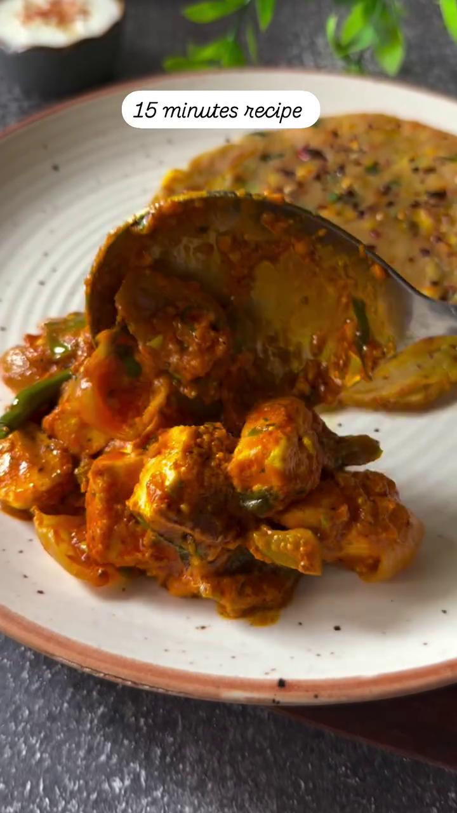
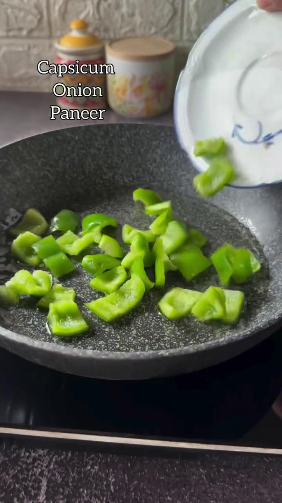

# Recipe Generated from Instagram Reel

1. Recipe Name: Ginger Garlic Tomato Curry

2. Ingredients:
- 1 tbsp ginger paste
- 1 tbsp garlic paste
- 1 green chili, chopped
- 1 cup tomato purée
- Handful of fresh coriander leaves
- Salt to taste
- 2 tbsp oil

3. Step-by-step Instructions:
Step 1: Heat 2 tbsp of oil in a pan over medium heat.
Step 2: Add 1 tbsp of ginger paste and 1 tbsp of garlic paste. Sauté for a minute until fragrant.
Step 3: Add 1 chopped green chili and cook for another minute.
Step 4: Pour in 1 cup of tomato purée and stir well to combine all the ingredients.
Step 5: Season with salt according to your taste preference.
Step 6: Cook the mixture for about 10-15 minutes on low heat, stirring occasionally until the curry thickens.
Step 7: Garnish with a handful of fresh coriander leaves.
Step 8: Serve the Ginger Garlic Tomato Curry hot with rice or bread.

4. Additional Tips:
- Adjust the spice level by adding more or fewer green chilies.
- You can customize this curry by adding vegetables like bell peppers, peas, or potatoes.
- For a creamier texture, you can add a splash of coconut milk or cream towards the end of cooking.

## Recipe Steps with Images

### Step 1

### Step 2

### Step 3

### Step 4

### Step 5

### Step 6

### Step 7

### Step 8

